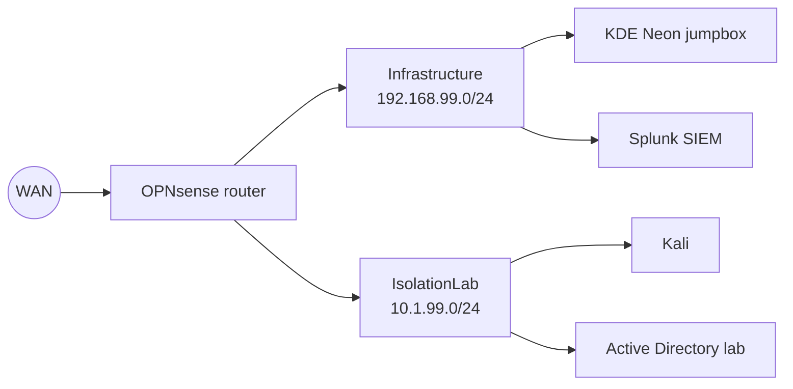

My lab runs on a single Proxmox host I call `lanServer`. I built it following *The Homelab Almanac* by Michael Taggart.

<!-- TODO: add hardware specs, why you built it, and screenshots. -->

## Network layout

Everything routes through an OPNsense VM, with three bridges keeping traffic separated.

| Bridge | Subnet | Purpose |
|---|---|---|
| WAN | upstream | Internet uplink |
| Infrastructure | 192.168.99.0/24 | Management and core services |
| IsolationLab | 10.1.99.0/24 | Attack and target machines |

<!-- TODO: double-check which VMs live on which bridge and fix the diagram above. -->

## Infrastructure as code

Once the core was up, I automated builds instead of clicking through installers:

1. **Packer** builds VM templates.
2. **Terraform** provisions VMs on Proxmox from those templates.
3. **Ansible** configures them after boot.
4. **HashiCorp Vault** holds secrets.

## Things that broke

**KDE login loop after `pkcon update`.** The jumpbox stopped letting me log in after an update. I rolled back to a Proxmox snapshot, which is the best argument I know for taking snapshots before every update.

**Login loop after `chsh` to fish.** Changing the default shell locked me out of the desktop session. Lesson: test a new login shell in a terminal before making it the default.

## What's next

<!-- TODO: your next steps. -->
